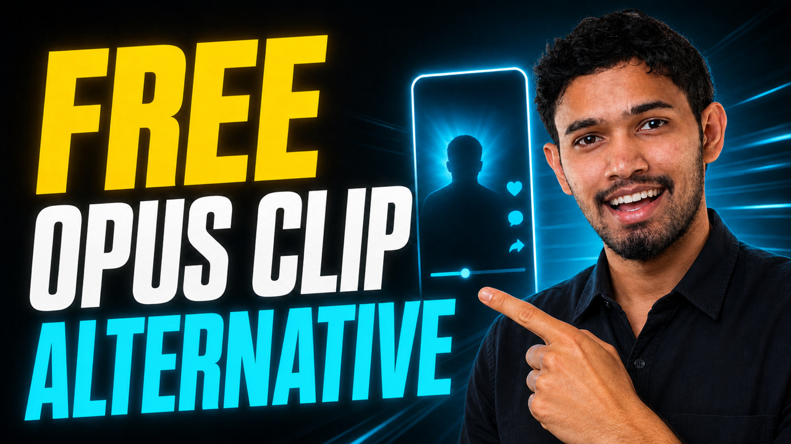

# AI YouTube Shorts Generator

[](https://muapi.ai?utm_source=github&utm_medium=badge&utm_campaign=ai-youtube-shorts-generator)


**The open-source alternative to Opus Clip, Vidyo.ai, Klap, SubMagic, 2short.ai, and other AI clipping tools.** Drop in any long-form YouTube video and get back ranked, viral-ready 9:16 shorts — for free, with no per-clip credits, no watermarks, and full control over the highlight algorithm.

Built for creators, agencies, and developers who don't want to pay $20–$300/month or be capped on minutes processed. Uses GPT-class LLM highlight detection and Whisper transcription to extract the most viral-worthy moments and auto-crop them vertically for TikTok, Reels, and Shorts.

<p align="center"><a href="https://www.youtube.com/watch?v=aJT-kRASzfE"></a></p>
<p align="center"><a href="https://www.youtube.com/watch?v=aJT-kRASzfE"><b>▶ Watch: Free Open-Source Opus Clip Alternative (Build It in 10 Minutes)</b></a></p>

> **Building your own Opus Clip–style SaaS?** Skip the infra and ship on the same APIs that power this repo:
> - [AI Clipping API](https://muapi.ai/playground/ai-clipping?utm_source=github&utm_medium=readme&utm_campaign=ai-youtube-shorts-generator) — end-to-end clip selection + render
> - [Auto-Crop API](https://muapi.ai/playground/autocrop?utm_source=github&utm_medium=readme&utm_campaign=ai-youtube-shorts-generator) — vertical reframing only


<p align="center">
  <a href="https://github.com/Anil-matcha/awesome-generative-ai-apps">
    
  </a>
</p>

> 🎨 **[Explore 50+ more open-source AI apps →](https://github.com/Anil-matcha/awesome-generative-ai-apps)**

## Why Use This Instead of Opus Clip / Vidyo.ai / Klap?

| | This repo | Opus Clip / Vidyo.ai / Klap / SubMagic |
|---|---|---|
| **Price** | Free + open source (pay only for LLM API usage) | $20–$300/month subscriptions |
| **Per-clip credits** | None — process unlimited videos | Monthly minute caps, overage fees |
| **Watermarks** | Never | On free tiers |
| **Highlight algorithm** | Fully editable virality framework | Black box |
| **Output format** | 9:16 vertical with real word-by-word captions | Locked presets |
| **Editing** | Built-in Django web UI with clip editor + trimmer | SaaS-only |
| **Batch processing** | `xargs` an entire URL list | Manual upload one-by-one |
| **JSON / API output** | Built-in (`--output-json`) | Limited or paid tier only |
| **Self-hostable** | Yes — runs on your machine or server | SaaS only, your videos sit on their servers |
| **White-label / embeddable** | Yes — MIT licensed, import as Python lib | No |

## Features

- **🎬 YouTube In, Vertical Out**: Hand it any YouTube URL or local file — get back N viral-ready 9:16 mp4s
- **🏠 Local Mode by Default**: `--mode local` runs entirely on your machine with `yt-dlp`, `faster-whisper`, and `ffmpeg`/OpenCV. Only the highlight-ranking LLM step is remote (OpenAI or Gemini, your choice)
- **🌐 Browser-Link Downloading**: When YouTube triggers sign-in/bot detection, the downloader auto-extracts cookies from Chrome/Edge/Firefox/Brave/Opera — or use a manually exported `cookies.txt` in the project root
- **🤖 Virality-Aware Highlight Selection**: Clips ranked on hooks, emotional peaks, opinion bombs, revelation moments, conflict, quotable lines, story peaks, and practical value — not just generic "interesting"
- **📈 Score + Hook + Reason for Every Clip**: Each highlight comes with a viral score, an opening hook line, and a one-sentence explanation of why it works
- **🎤 Local Whisper Transcription**: `faster-whisper` on CPU or CUDA, with a transcript cache (`.srt` + word-timestamp sidecar) so re-runs skip Whisper entirely
- **🔤 Real Word-by-Word Captions**: Captions are burned into each clip, highlighted in sync with the audio from Whisper word timestamps — not a static text block
- **🧩 Cropping Templates**: `stage_solo_speaker` (Stage & Solo Speaker) and `podcast_split_screen` (Podcast & Dialogue) — each a 1080×1920 canvas with a pre-scanned, motion-smoothed face-tracking trajectory
- **🧠 Long-Video Aware**: Videos over 30 minutes are auto-chunked (10-min chunks, 60s overlap) so nothing gets missed
- **♻️ Smart Dedupe**: Overlapping highlights are collapsed by score so you never get two near-duplicate clips
- **🛜 Two LLM Providers**: `LLM_PROVIDER=openai` (works with Groq, DeepSeek, etc. via `OPENAI_BASE_URL`) or `LLM_PROVIDER=gemini`, both with retry/backoff
- **🖥️ Django Web UI**: A browser interface to download, transcribe, pick clips from the transcript, generate shorts, and re-cut them with text overlays, watermarks, and background audio
- **🧰 CLI + Python Library**: Use it from the shell or import `generate_shorts(...)` into your own pipeline
- **📦 JSON Output**: `--output-json` dumps the full result (transcript + every candidate highlight + final clip paths) for downstream automation
- **📊 Live Progress Bars**: Inline progress with ETA for download, transcription, ranking, and per-frame rendering (auto-disabled when not on a TTY)

## Quick Start (No Setup)

Don't want to self-host? The [AI Clipping API](https://muapi.ai/playground/ai-clipping?utm_source=github&utm_medium=readme&utm_campaign=ai-youtube-shorts-generator) gives you the same Opus Clip–style pipeline as a single HTTP call — no Python, no dependencies, pay-per-clip instead of monthly subscriptions.

---

## Installation (Self-Hosted)

### Prerequisites

- Python 3.10+
- `ffmpeg` on your PATH (used for cutting and muxing)
- For **Local mode** (`--mode local`, default): an LLM API key — `OPENAI_API_KEY` or `GEMINI_API_KEY` (only the highlight-ranking step is remote; everything else runs offline)
- For **API mode** (`--mode api`, kept for reference): a MuAPI key
- For the **Web UI**: Django (optional — the CLI works without it)

### Steps

1. **Clone the repository:**
   ```bash
   git clone https://github.com/SamurAIGPT/AI-Youtube-Shorts-Generator.git
   cd AI-Youtube-Shorts-Generator
   ```

2. **Create and activate a virtual environment:**
   ```bash
   python3.10 -m venv venv
   source venv/bin/activate
   ```

3. **Install Python dependencies:**
   ```bash
   pip install -r requirements.txt
   pip install -r requirements-local.txt
   # Optional, only if you want the web UI:
   pip install django
   ```

4. **Set up environment variables:**

   Create a `.env` file in the project root:
   ```bash
   # Local mode (default)
   LLM_PROVIDER=openai           # openai or gemini
   OPENAI_API_KEY=your_openai_key_here
   OPENAI_MODEL=gpt-4o-mini
   # Optional: use a compatible provider (Groq, DeepSeek, ...)
   # OPENAI_BASE_URL=https://api.groq.com/openai/v1
   # OPENAI_MODEL=llama-4-scout
   GEMINI_API_KEY=your_gemini_key_here
   GEMINI_MODEL=gemini-2.5-flash

   LOCAL_WHISPER_MODEL=base          # tiny / base / small / medium / large-v3
   LOCAL_WHISPER_DEVICE=auto         # auto / cpu / cuda
   LOCAL_OUTPUT_DIR=output           # where mp4s + caches land
   # TEMPLATE=stage_solo_speaker     # default cropping template
   ```

## Usage

### Single video (Local mode — default)

```bash
python main.py "https://www.youtube.com/watch?v=VIDEO_ID"
```

Local mode writes the rendered shorts to `./output/short_01.mp4`, `short_02.mp4`, … (override with `LOCAL_OUTPUT_DIR`).

### Single video (API mode — kept for reference)

```bash
python main.py "https://www.youtube.com/watch?v=VIDEO_ID" --mode api
```

### With options

```bash
python main.py "https://www.youtube.com/watch?v=VIDEO_ID" \
    --num-clips 5 \
    --template podcast_split_screen \
    --min-clip-seconds 30 \
    --max-clip-seconds 45 \
    --output-json result.json
```

### Local file or path

Pass a `file://` URL or a direct filesystem path and skip YouTube entirely:

```bash
python main.py "/Users/you/Videos/input.mp4"
python main.py "file:///Users/you/Videos/input.mp4"
```

The Python API works the same way:

```python
from shorts_generator import generate_shorts

result = generate_shorts(
    "/Users/you/Videos/input.mp4",
    num_clips=5,
    mode="local",
)
for short in result["shorts"]:
    print(short["score"], short["title"], short["clip_url"])
```

### Caching

- **Transcription** is cached as `output/source_<name>.srt` (plus a `.words.json` sidecar for caption sync). If the cache is newer than the source file, Whisper is skipped entirely.
- **Downloads** are cached as `output/source_<youtube_id>.mp4`. If the file already exists, `yt-dlp` is skipped.

### Batch processing

Create a `urls.txt` file with one URL per line, then:

```bash
xargs -a urls.txt -I{} python main.py "{}"
```

### CLI flags

| Flag | Default | Notes |
|------|---------|-------|
| `--mode` | `local` | `local` (default, yt-dlp + faster-whisper + LLM provider + ffmpeg) or `api` (MuAPI, kept for reference) |
| `--num-clips` | `10` | How many shorts to render |
| `--format` | `720` | Source download resolution: `360` / `480` / `720` / `1080` |
| `--language` | auto | Force Whisper language code (e.g. `en`) |
| `--min-clip-seconds` | `30` | Drop highlights shorter than this — short-form feeds don't retain sub-30s clips |
| `--max-clip-seconds` | `60` | Hard cap on clip length; longer highlights are truncated to `start_time + N` (max 60) |
| `--template` | `stage_solo_speaker` | Cropping template — `stage_solo_speaker` or `podcast_split_screen` |
| `--output-json` | — | Dump the full result (transcript + all candidates) to a file |

## Web UI (Django)

A browser-based editor for the local pipeline. Start it with:

```bash
python manage.py migrate          # first run only
python manage.py runserver        # or double-click run_webui.bat
```

Then open **http://127.0.0.1:8000**.

**Workflow** — paste a YouTube URL → **Download** → **Transcribe** → **Pick clips** (browse the transcript and mark start/end ranges) → **Generate** vertical shorts. The home page tracks each video through the pipeline (Downloaded → Transcribed → Clips → Generated).

**Clip editor** (`/video/<id>/`):
- Browse the SRT transcript with timestamps
- Add / delete clip ranges, then render them all at once with a chosen template
- Watch generated shorts inline (byte-range streaming support)

**Trimmer** (`/video/<id>/trim/<filename>/`): re-cut any generated short with:
- **Text overlays** — font size, color, background box, stroke, uppercase, pop-in animation
- **Watermark / logo** overlay (uploaded images, positioned + scaled)
- **Background audio** layers (uploaded files) with optional auto-ducking and source-volume control
- **Cut ranges** to remove sections from the middle of a clip

## How It Works (Local Mode)

1. **Download**: `yt-dlp` fetches the source video (`output/source_<id>.mp4`), reusing an existing download. Falls back to browser cookies or a manual `cookies.txt` when YouTube demands sign-in
2. **Transcribe**: `faster-whisper` (CPU or CUDA) produces a timestamped transcript with word-level timestamps, cached as `.srt`
3. **Detect content type**: An LLM classifies the video (podcast, interview, tutorial, vlog, etc.) and density, so the prompt can be tuned per content style
4. **Long-video chunking**: Videos > 30 min are split into 10-min overlapping chunks (60s overlap)
5. **Highlight ranking**: An LLM scans the transcript through a virality framework — hook moments, emotional peaks, opinion bombs, revelations, conflict, quotables, story peaks, practical value — and emits ranked candidates with scores 0–100 and a hard 30–60s window
6. **Dedupe**: Overlapping candidates are collapsed by score (>50% overlap → keep the higher score)
7. **Auto-crop**: Each highlight is pre-scanned for a smoothed face-tracking trajectory, then rendered into the selected template's 1080×1920 canvas with word-by-word captions, a hook title, and audio muxed from the source

**Output**: a list of local mp4 paths plus, for each clip, its title, viral score, hook sentence, and a one-line reason explaining why it should perform.

## Cropping Templates

Templates are declared in `shorts_generator/local/clipper.py` (`TEMPLATE_SPECS`). The output is always a 1080×1920 (9:16) canvas with safe zones (23% top / 60% stage / 17% bottom).

| Key | Label | Layout |
|---|---|---|
| `stage_solo_speaker` | Stage & Solo Speaker | Video fills a 1080×1152 "stage"; hook title in the top safe zone; word-by-word captions in the lower band |
| `podcast_split_screen` | Podcast & Dialogue | Two stacked 9:8 panels (1080×960 each); each half tracks its own speaker's face |

Rendering is two-pass: a low-FPS pre-scan detects faces and builds a smooth camera trajectory (median filter + EMA + smoothstep), then every frame is composited from the pre-computed path — no jitter. If the scene is too wide to fit 9:16, a blurred-fill fallback is used instead of cropping.

## Output

Console output looks like:

```
================================================================================
Mode:          local
Template:      stage_solo_speaker
Source video:  output/source_VIDEO_ID.mp4
Highlights:    7 candidates -> kept top 3
================================================================================

#1  score=92  124.3s -> 184.3s
     title:  The one mistake that cost me $50K
     hook:   "Nobody talks about this, but it killed my first startup..."
     clip:   output/short_01.mp4

#2  score=88  ...
```

`--output-json result.json` produces:

```json
{
  "source_video_url": "output/source_VIDEO_ID.mp4",
  "mode": "local",
  "transcript": { "duration": 1873.4, "segments": [...] },
  "highlights": [ {...}, {...}, ... ],
  "shorts": [
    {
      "title": "...",
      "start_time": 124.3,
      "end_time": 184.3,
      "score": 92,
      "hook_sentence": "...",
      "virality_reason": "...",
      "clip_url": "output/short_01.mp4"
    }
  ]
}
```

## Configuration

### Highlight selection criteria
Edit `shorts_generator/highlights.py`:
- **Virality framework**: `VIRALITY_CRITERIA` — the ranked list of signals the LLM optimizes for
- **System prompt**: `HIGHLIGHT_SYSTEM_PROMPT` — duration sweet spot, hook rules, JSON schema
- **Chunk size**: `CHUNK_SIZE_SECONDS` (default 600) — chunk length for long videos
- **Long-video threshold**: `LONG_VIDEO_THRESHOLD` (default 1800) — videos longer than this are chunked
- **Chunk overlap**: `CHUNK_OVERLAP_SECONDS` (default 60) — overlap between chunks so cross-boundary clips aren't missed

### Cropping templates & captions
Edit `shorts_generator/local/clipper.py`:
- **`TEMPLATE_SPECS`** — add a new template (layout type, typography, widgets)
- **Canvas constants** — `CANVAS_W/H`, safe zones, caption font/colors
- **`_render_stage_canvas` / `_render_podcast_canvas`** — the per-template compositors

### LLM & Whisper
Edit `shorts_generator/config.py` (or set env vars):
- `LLM_PROVIDER`, `OPENAI_*`, `GEMINI_*` — local LLM backend + model
- `LOCAL_WHISPER_MODEL`, `LOCAL_WHISPER_DEVICE` — Whisper size and CPU/CUDA
- `LOCAL_WHISPER_VAD_FILTER` — Voice Activity Detection (off by default; too aggressive on mixed speech/music)
- `TEMPLATE` — default cropping template

## Project Structure

```
AI-Youtube-Shorts-Generator/
├── main.py                       CLI entry point
├── manage.py                     Django entry point (web UI)
├── run_webui.bat                 Windows web UI launcher
├── requirements.txt              core deps
├── requirements-local.txt        deps for --mode local (yt-dlp, faster-whisper, opencv, LLM SDKs)
├── .env.example
├── webui/                        Django web UI (download / transcribe / clip editor / trimmer)
│   ├── settings.py               sqlite + OUTPUT_DIR wiring
│   ├── models.py                 Clip (video_id, start_time, end_time)
│   ├── views.py                  download / transcribe / editor / generate / trim / uploads
│   └── templates/webui/          home, clip_editor, trim_short, video_list
└── shorts_generator/
    ├── config.py                 env / settings (LLM + Whisper + VAD)
    ├── highlights.py             shared LLM virality ranking (pluggable backend)
    ├── pipeline.py               mode dispatcher (api ↔ local) + generate_shorts()
    ├── progress.py               progress bars / spinners with ETA
    ├── muapi.py                  API mode: MuAPI submit + poll wrapper
    ├── downloader.py             API mode: YouTube download via MuAPI
    ├── transcriber.py            API mode: MuAPI /openai-whisper client
    ├── clipper.py                API mode: MuAPI /autocrop
    └── local/                    --mode local backends (offline)
        ├── downloader.py         yt-dlp download + caching + cookie fallback
        ├── transcriber.py        faster-whisper transcription + .srt cache
        ├── cookies.py            manual cookies.txt / browser cookie extraction
        ├── llm.py                OpenAI or Gemini client with retry/backoff
        └── clipper.py            ffmpeg cut + OpenCV template-based vertical crop + captions
```

## Troubleshooting

### Whisper produced no segments
The video may have no detectable speech, or it may be in a language Whisper struggles with. Try passing `--language en` (or the correct ISO-639-1 code) to skip auto-detection.

### YouTube demands sign-in / bot detection
The downloader automatically tries your browser's cookies (Chrome/Edge/Firefox/Brave/Opera). If that fails — typically because the browser's cookie DB is locked/encrypted — close the browser and retry, or export cookies manually:
```bash
yt-dlp --cookies cookies.txt --skip-download <video-url>
```
Then drop `cookies.txt` in the project root.

### `[WinError 32] The process cannot access the file`
A Windows file-lock race from an earlier render. Audio is now read from the original source rather than the cut clip to avoid this; if you still hit it, close any player that has the mp4 open and re-run.

### Looking for better results?
The [AI Clipping API](https://muapi.ai/playground/ai-clipping?utm_source=github&utm_medium=readme&utm_campaign=ai-youtube-shorts-generator) uses an improved algorithm that produces higher-quality clips with better highlight detection.

## Contributing

Contributions are welcome! Please fork the repository and submit a pull request.

## License

This project is licensed under the MIT License.

## Related Projects

- [AI Influencer Generator](https://github.com/SamurAIGPT/AI-Influencer-Generator)
- [Text to Video AI](https://github.com/SamurAIGPT/Text-To-Video-AI)
- [Faceless Video Generator](https://github.com/SamurAIGPT/Faceless-Video-Generator)
- [AI B-roll Generator](https://github.com/Anil-matcha/AI-B-roll)
- [No-code YouTube Shorts Generator](https://www.vadoo.tv/clip-youtube-video)
- [ai-creator-academy](https://github.com/Anil-matcha/ai-creator-academy) — free curriculum teaching creators how to monetize AI-generated shorts and video content
